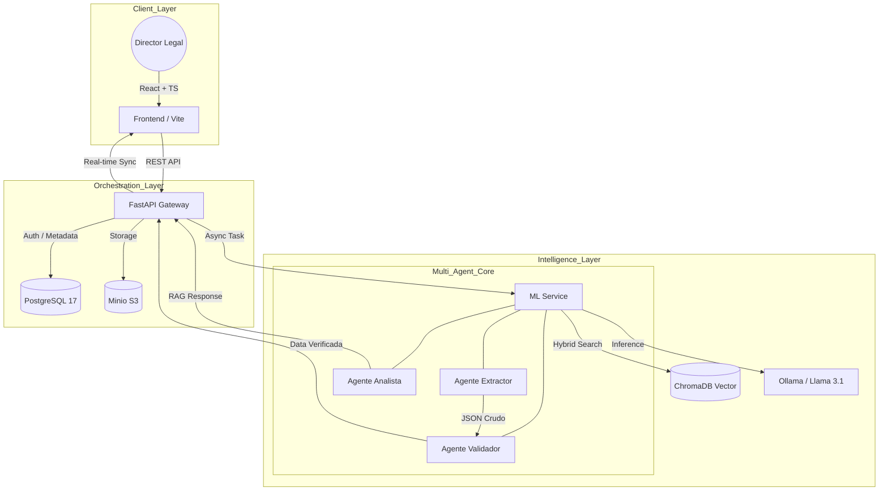

# LeaseLens AI: Smart Contract Intelligence 🚀

## Overview

* [ ]

---

## Arquitectura del Sistema (Enterprise Orchestration)

El Backend actúa como el **Cerebro Operativo**, gestionando la seguridad, la persistencia y la orquestación de tareas pesadas hacia el motor de ML.

---

## El Ecosistema Multi-Agente

Para eliminar alucinaciones y garantizar el cumplimiento normativo, el procesamiento de cada contrato sigue un flujo cognitivo dividido en tres agentes especializados:

### 1. Agente Extractor (The Document Worker)

* **Estrategia:** Divide y Vencerás.
* **Operación:** Analiza el documento página por página (Context Window Optimization).
* **Configuración:** `Temperature: 0.0` (Determinístico).
* **Responsabilidad:** Extraer llaves exactas (`monto_renta`, `start_date`, `tenant_name`). No interpreta, solo localiza y transcribe a JSON puro.

### 2. Agente Validador (The Auditor)

* **Estrategia:** Cross-Verification.
* **Operación:** Recibe el JSON del Extractor y el texto completo del contrato.
* **Configuración:** `Temperature: 0.1` (Analítico).
* **Misión Crítica:** Diferenciar entre conceptos similares que confunden a IAs genéricas (ej: distinguir el "Depósito en Garantía" de la "Renta Mensual"). Si detecta una inconsistencia, re-escanea el texto original para corregir el dato antes de mandarlo al Backend.

### 3. Agente Analista (The Contextual Analyst)

* **Estrategia:** RAG Híbrido (Cognitive Router).
* **Operación:** Interfaz del chat persistente.
* **Habilidad Especial:** Sabe cuándo usar la **Memoria Global** (PostgreSQL) para datos estadísticos rápidos y cuándo usar la **Memoria Local** (ChromaDB) para buscar cláusulas específicas dentro de los PDFs.

---

## Stack Tecnológico

| Capa          | Tecnologías                                              |
| :------------ | :-------------------------------------------------------- |
| **UI/UX**     | React 18, TypeScript, Tailwind v4, Framer Motion          |
| **Logic**     | Python 3.11, FastAPI, SQLAlchemy                          |
| **Inference** | Ollama (Llama 3.1 8B), EasyOCR, PyMuPDF                   |
| **Data**      | PostgreSQL 17 (Metadata), ChromaDB (Vectores), Minio (S3) |
| **Infra**     | Docker, Docker Compose (GPU Passthrough)                  |

---

## Estándares de Seguridad (Mifel Context)

1. **Zero-Trust Extraction:** El Agente Validador actúa como una capa de QA humana-like, asegurando que los montos financieros sean exactos.
2. **Encapsulamiento de Archivos:** Los contratos nunca se exponen públicamente. Se generan **URLs Firmadas (S3v4)** con expiración temporal para previsualización e inicio de sesión seguro.
3. **Memoria Persistente:** Los chats se almacenan por sesión de usuario, permitiendo trazabilidad histórica de las consultas legales.
4. **Optimización de Recursos:** Implementación de **LLM Warm-up** y pre-procesamiento de imágenes (Grayscale/Resize) para maximizar el throughput de la GPU.

---

## Roadmap

- [X]  RAG Híbrido Multi-Agente.
- [X]  Dashboard Legal Interactivo con Sort & Meta-analysis.
- [X]  Sidebar de Chat Colapsable con Memoria.
- [X]  Barra de Progreso en Tiempo Real (Fases 1-5).
- [ ]  Exportación de Auditorías a PDF/Excel.
- [ ]  Conector nativo con Mifel Auth.

---

*Building the future of legal ops with high-performance AI.*
