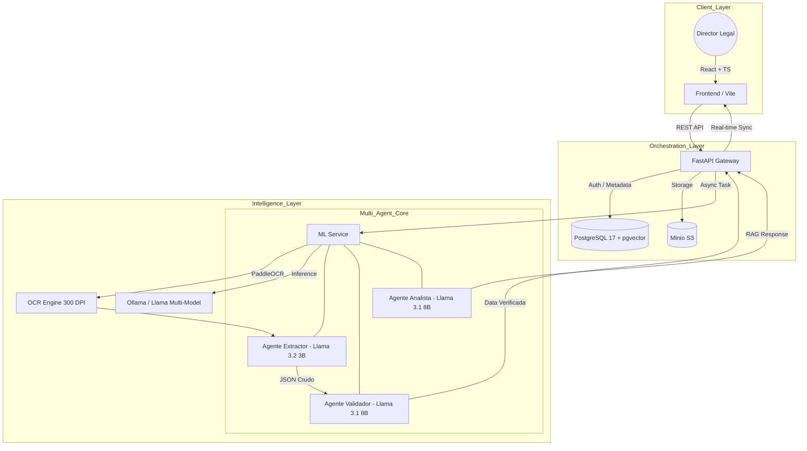

# LeaseLens AI: Intelligence Legal & Financial OCR 🚀

LeaseLens AI es un sistema de inteligencia avanzada diseñado para automatizar el ciclo de vida de los contratos de arrendamiento. Utilizando una arquitectura multi-agente y RAG Híbrido, el sistema extrae, valida y analiza datos contractuales con precisión quirúrgica, optimizado para el contexto de innovación bancaria (Mifel).

## Overview

*   **Extracción de Alta Fidelidad:** Motor OCR basado en PaddleOCR optimizado a 300 DPI para capturar cifras y fechas sin errores.
*   **Arquitectura Multi-Agente:** Orquestación de modelos Llama 3.2 (3B) y 3.1 (8B) para separar la extracción determinística del análisis complejo.
*   **RAG Híbrido:** Combinación de búsqueda semántica en vectores (Memoria Local) con resúmenes estructurados en SQL (Memoria Global).
*   **Seguridad Enterprise:** Gestión de archivos mediante Minio S3 con URLs firmadas (S3v4) y cifrado en tránsito.

---

## Arquitectura del Sistema (Enterprise Orchestration)

El sistema utiliza **PGVector** integrado en PostgreSQL 17 para una búsqueda vectorial escalable, eliminando la necesidad de bases de datos de vectores externas.



---

## El Ecosistema Multi-Agente

### 1. Agente Extractor (Llama 3.2 3B)
*   **Rol:** Worker determinístico.
*   **Foco:** Transcripción exacta de llaves financieras (`monto_renta`, `moneda`, `vigencia`).
*   **Optimización:** Configurado con `Temperature: 0.0` y un prompt anti-bloqueo que fuerza el formato JSON puro.

### 2. Agente Validador (Llama 3.1 8B)
*   **Rol:** Auditor de Calidad.
*   **Misión:** Realizar "Cross-Verification" entre cifras numéricas y su representación escrita en el contrato. Detecta discrepancias del OCR y asegura la integridad de los datos antes de la persistencia.

### 3. Agente Analista (Contextual Analyst)
*   **Rol:** Interfaz RAG.
*   **Habilidad:** Router cognitivo que consulta el resumen del portafolio en PostgreSQL y los fragmentos específicos en PGVector para responder preguntas complejas sobre riesgos y términos legales.

---

## Stack Tecnológico

| Capa          | Tecnologías                                              |
| :------------ | :-------------------------------------------------------- |
| **Frontend**  | React 18, TypeScript, Tailwind CSS v4, Framer Motion      |
| **Backend**   | Python 3.11, FastAPI, SQLAlchemy, Uvicorn                 |
| **ML / OCR**  | PaddleOCR (300 DPI), PyMuPDF, Nomic-Embed-Text v1.5       |
| **LLMs**      | Ollama (Llama 3.2 3B & Llama 3.1 8B)                      |
| **Database**  | PostgreSQL 17 + pgvector (Integrated Vector Search)       |
| **Storage**   | Minio S3 (Presigned URLs / S3v4)                          |
| **Infra**     | Docker, Docker Compose (GPU Passthrough Support)          |

---

## Inicio Rápido (Quick Start)

El proyecto utiliza un `Makefile` para simplificar la orquestación de contenedores.

### 1. Configuración de Entorno
Copia el archivo de ejemplo y configura tus credenciales:
```bash
cp .env.example .env
```

### 2. Despliegue con Docker
Para ejecución estándar (CPU):
```bash
make run
```

Para ejecución optimizada con GPU (NVIDIA Docker Toolkit requerido):
```bash
make run_gpu
```

### 3. Comandos Útiles
*   **Detener sistema:** `make stop`
*   **Limpiar volúmenes:** `make down`
*   **Ver logs de un servicio:** `make logs SERVICE_NAME=ml-service`

---

## Estándares de Seguridad

1.  **Zero-Trust Extraction:** Todo dato extraído es auditado por un segundo modelo antes de ser visible en el Dashboard.
2.  **Encapsulamiento S3:** Acceso a documentos mediante túneles SSL y URLs con expiración de 1 hora.
3.  **Validación Numérica:** Backend utiliza `clean_numeric` para asegurar tipos `float` y sanitización de montos.
4.  **Aislamiento de Procesos:** El motor de ML corre en un sandbox dedicado sin acceso directo a la base de datos transaccional.

---

*LeaseLens AI - Desarrollado para la eficiencia computacional extrema y la escalabilidad legal.*
